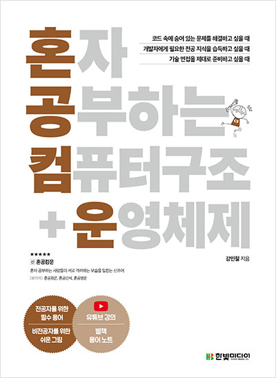

# 컴퓨터 구조

## 설명

- 참고 도서를 바탕으로 정리한 **컴퓨터 구조 PDF 슬라이드 모음**입니다. 
- GitHub에서 PDF 열람이 불편하다면 [해당 링크(노션 페이지)](https://subdued-march-f96.notion.site/263d5be0738f8033a67cfd8e3523a58e?pvs=74)
에서 확인하시면 됩니다.

## 참고 도서
- [혼자 공부하는 컴퓨터 구조+운영체제]
    - 저자 : [강민철]
    - 출판사 : [한빛미디어]
    - 최초 발행일 : [2022-08-16]
    - ISBN: [9791162243091 (ISBN10: 1162243090)]
    

    

## 참조 링크
- [동영상 강의](https://www.youtube.com/watch?v=kFWP6sFKyp0&list=PLYH7OjNUOWLUz15j4Q9M6INxK5J3-59GC)

- [참고 도서 Github](https://github.com/kangtegong/self-learning-cs/tree/main)